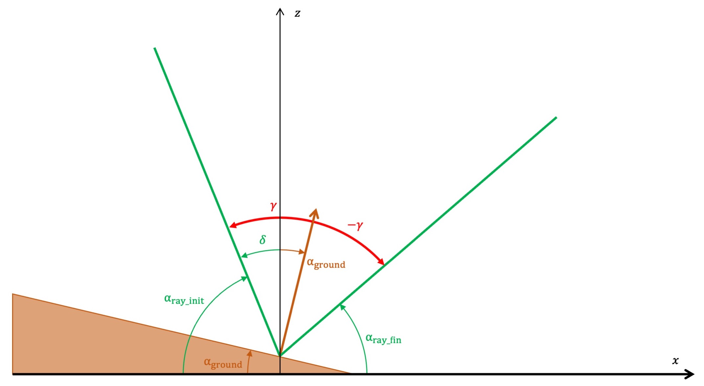

# Data 2021 – Sound propagation in the ocean

## Propagation equations
Sound rays behave analogously to light rays. When traversing a medium, the change in their velocity induces an effect of refraction.

The base equation for refraction of sound is
$$
{\sin(\theta_1) \over c_1} = {\sin(\theta_0) \over c_0} = \sigma
$$

This leads to the differential equation:
$$
{\mathrm{d}^2 z \over \mathrm{d} x^2} = - \left( {c_0 \over \sin(\theta_0)} \right)^2 {g(z) \over {c(z)}^3}
$$
where $g = {\mathrm{d}c / \mathrm{d}z}$ is the gradient of $c$.

  

## Computing reflections

$$
\alpha_\mathrm{ground} = \arctan \left({ \mathrm{d}z_\mathrm{ground} \over \mathrm{d}x}\right)
$$
$$
\alpha_\mathrm{ray\_init} = \arctan \left({ \mathrm{d}z_\mathrm{ray\_init} \over \mathrm{d}x}\right)
$$
$$
\gamma = \delta - \alpha = {\pi \over 2} - \alpha_\mathrm{ray\_init} - \alpha_\mathrm{ground}
$$
$$
\alpha_\mathrm{ray\_fin} = {\pi \over 2} - \alpha_\mathrm{ground} + \gamma = \pi - \alpha_\mathrm{ray\_init} - 2 \alpha_\mathrm{ground}
$$
$$
{ \mathrm{d}z_\mathrm{ray\_fin} \over \mathrm{d}x} = \tan \left( \alpha_\mathrm{ray\_fin} \right)
$$

  

## Oceanography

### Sound velocity models in seawater
- Equation of state
- Simplified models

### Ocean temperature
https://archive.bigelow.org/shipmates/octemp.html
Data: https://dods.ndbc.noaa.gov/thredds/catalog.html

### Ocean salinity
Salinity ($S$) can be considered an invariant of depth.

 
Temperature versus salinity gradients below the ocean mixed layer:

<a href="https://agupubs.onlinelibrary.wiley.com/doi/full/10.1029/2011JC007382">Journal of Geophysical Research: Oceans, Volume: 117, Issue: C5, First published: 03 May 2012, DOI: (10.1029/2011JC007382)</a>
 

  

## Sound absorption in seawater
The formula for the absorption of sound in seawater is as follows:
$$
\alpha = \alpha_{\mathrm{H}_3\mathrm{B}\mathrm{O}_3} e^{(\mathrm{pH}-8)/0.56} + \alpha_{\mathrm{Mg}\mathrm{S}\mathrm{O}_4}e^{z/6} + \alpha_{\mathrm{H}_2\mathrm{O}}e^{z/17-T/27} \ \mathrm{dB}\cdot\mathrm{km}^{-1}
$$

Where:
* $\alpha_{\mathrm{H}_3\mathrm{B}\mathrm{O}_3} = 0.106 \frac{f_1 f^2}{f_1^2 + f^2}$ with $f_1 = 0.78\sqrt{S/35}\,e^{T/26}$ is the absorption due to the relaxation of the boric acid ($\mathrm{H}_3\mathrm{B}\mathrm{O}_3$) in solution ($f_1$ is the relaxation frequency, in $\mathrm{kHz}$)
* $\alpha_{\mathrm{Mg}\mathrm{S}\mathrm{O}_4} = 0.52 \left( 1 + {T \over 43} \right)\left({S \over 35}\right) \frac{f_2 f^2}{f_2^2 + f^2}$ with $f_2 = 42 e^{T/17}$ is the absorption due to the relaxation of the magnesium sulfate ($\mathrm{Mg}\mathrm{S}\mathrm{O}_4$) in solution ($f_2$ is the relaxation frequency, in $\mathrm{kHz}$)
* $\alpha_{\mathrm{H}_2\mathrm{O}} = 0.00049 f^2$ is the visquous absorption of pure water

 

* $f$ is the signal frequency (in $\mathrm{kHz}$)
* $z$ is the altitude (in $\mathrm{km}$), negative under the surface
* $T(z)$ is the seawater temperature (in ℃)
* $S(z) \approx S$ is the seawater salinity (in $\mathrm{ppt}$)
* $\mathrm{pH}(z) \simeq 8.1$ is the seawater acidity

  

## Resources
- NOAA – World Ocean Database: https://www.ncei.noaa.gov/products/world-ocean-database (https://www.nodc.noaa.gov/access/)
- GEBCO Bathymetry data: https://download.gebco.net
